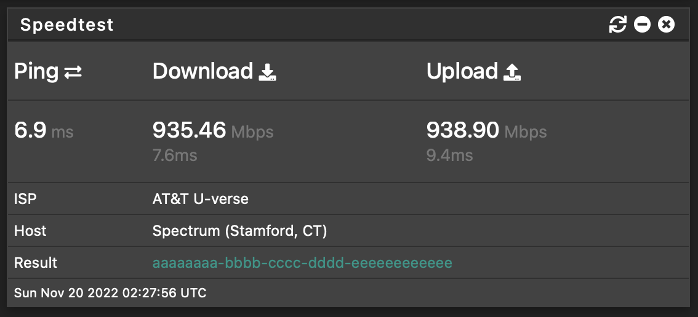

# Ookla Speedtest CLI dashboard widget for pfSense

Updated [aln-1/pfsense-speedtest-widget](https://github.com/aln-1/pfsense-speedtest-widget) for use with the official Ookla Speedtest CLI

## Install

To use this widget you will need to install the speedtest package. For full instructions, read FreeBSD section at https://www.speedtest.net/apps/cli

Quick Start:
```
pkg update ; pkg add "https://install.speedtest.net/app/cli/ookla-speedtest-1.2.0-freebsd12-x86_64.pkg"
```

Copy the widget file **speedtest.widget.php** to **/usr/local/www/widgets/widgets/** on your pfSense machine.

Install the widget on your dashboard.


