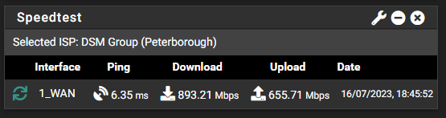

# Ookla Speedtest CLI dashboard widget for pfSense

This version uses the offical Ookla Speedtest Cli.

## Manual Installation

To use this widget you will need to install the speedtest package. For full instructions, read FreeBSD section at [https://www.speedtest.net/apps/cli](https://www.speedtest.net/apps/cli)

Quick Start:
```
pkg update && pkg install -g libidn2 ca_root_nss
# Example how to remove conflicting or old versions using pkg
# pkg remove speedtest
pkg add "https://install.speedtest.net/app/cli/ookla-speedtest-1.2.0-freebsd12-x86_64.pkg"
```

Copy the widget file **speedtest.widget.php** to **/usr/local/www/widgets/widgets/** on your pfSense machine.

Enable the widget on your dashboard.

## Auto Installation

Run this command:

```fetch -q -o - https://raw.githubusercontent.com/jackyaz/pfsense-speedtest-widget/master/install.sh | sh```

Enable the widget on your Dashboard.


